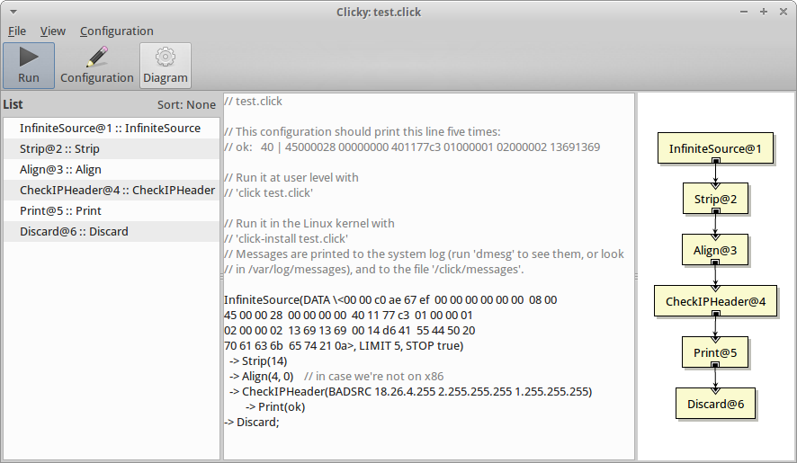

# Click router

## Quick description

### Background

Most routers have closed, static, and inflexible designs.

It is difficult for network administrators and third party software vendors to extend a router with new functions.

Click is a flexible, modular software architecture for creating routers.

Click routers are built from fine-grained components.
The components are packet processing modules called elements.


### Description

Click is a modular router toolkit.

Click is a software architecture for building configurable routers.

By using different combinations of packet processing units called _elements_, a Click router can be made to perform a specific kind of functionality (.e.g NAT proxy, firewall etc...).

Click is a modular software architecture enabling setup of a software router. A click router is built from elementary components called elements that constitute unit for packets processing.
The basic unit of communication between elements is the Packet.
Each element holds one or more input/output ports.

A click router configuration is an oriented graph of element where:

* vertices: processing applied to a packet
* edges: connections between ports and elements

To build a router configuration, the user chooses a collection of elements and connects them into a directed graph.

The router configuration is written in the Click language.

To extend a configuration, the user can write new elements or compose existing elements in new ways.

### Click language

(http://read.cs.ucla.edu/click/docs/language)

Click configuration language describes to Click how to process packets.
The language describes a graph of "elements", or packet processing modules. Click configuration is parsed when starting Click, Click builds object graph of elements.


### Layered Moded in Click

"With great power comes great responsibility."
 * Click receives raw ethernet frames from Layer 2 and handles all the processing up until it is handed to the higher layers.
 * Click can also handle Transport layer headers such as intercepting UDP and TCP packets making it possible to implement daemons inside Click.
 * The user is in charge of respecting the layered model, not Click.


## References

* web site: http://read.cs.ucla.edu/click/click
* git repository: https://github.com/kohler/click/
* Docs :
    * PhD : https://pdos.csail.mit.edu/papers/click:kohler-phd/thesis.pdf
    * Documentation related to user mode and kernel mode and about tools: http://read.cs.ucla.edu/click/docs
    * List of Click available elements: http://read.cs.ucla.edu/click/elements


## Click software

Click can be compiled as a user-level program or as a kernel module for Linux

cf **[Kernel vs User mode details](Kernel_vs_User.md)**

### User-Level Program

Run the user-level program by giving it the name of a configuration

```bash
click CONFIGFILE [ -p port]
```

### Kernel driver

To install a configuration and load the click kernel module it is required to use :

```bash
click-install CONFIGFILE
```

**WARNING** : The Linux kernel module is known to run (but not necessarily route packets) in kernel versions 2.6.24, 2.6.32, 3.0, 3.2, and 3.5. It should run on intermediate versions as well. *compilation will fail with linux kernek 4.x*

**WARNING2** : Click linux kernel has been successfully built using ubuntu server 14.04.1 with a kernel 3.13
NB since click commit c91fc67e3db click no more compile on ubuntu !


## Click installation

### Click sources

Git repository : https://github.com/kohler/click/ includes sources from click project with the following structure:

Git repository structure:
```
 .
 |-- conf                // various Click configuration files
 |-- drivers             // drivers with Click extensions (for polling)
 |-- elements            // the actual Click elements
 |-- etc                 // patch and other miscellaneous files
 |-- include
 |   |-- click           // base Click header files
 |-- lib                 // base Click cpp files
 |-- linuxmodule         // Click linux kernel mode files
 `-- userlevel           // Click user level files
```

### Build


```bash
$ sudo apt-get update
$ sudo apt-get -y install git gcc g++ make
$ git clone https://github.com/kohler/click.git
$ cd click

$ ### to display config options
$./configure --help

$ ### config to build click for user mode only
$ ./configure --enable-ip6 --disable-linuxmodule

$ ### config to build click for user & kernel mode using all available click elements
$ sudo ./configure --enable-all-elements

$ sudo make install

$ ### click binaries are installed in /usr/local/bin/
$ find /usr/local/bin/ -name "click*"

_NB The kernel installation will create two module object files click.ko and proclikefs.ko and place them in the installation directory /usr/local/lib._


### Display version of installed click
$ click -v

### List click tools available for kernel driver
$ find /usr/local/sbin/ -name "click*"
```

## Using Click

### Click Test

Click configurations for test : In the conf directory of the click git repo there is a set of configuration files see http://read.cs.ucla.edu/click/examples

#### userlevel driver

For instance, you can run the following to test a basic click configuration running at userlevel

```bash
$ click ~/click/conf/test.click
```

NB : To run a click configuration using a system device (e.g FromDevice(eth0)), it is required to run the command with sufficient privileges (i.e. with root privileges)

```bash
$ sudo click ~/click/conf/delay.click
```

#### kernel driver

For instance, you can run the following to test a basic click configuration running in **kernel mode**

```bash
$ sudo click-install ~/click/conf/testdevice.click
```

The configuration installed in kernel is visible in the <tt>/click</tt> directory

The command <code>click-uninstall</code> unload the click module and remove the current configuration (the <tt>/click</tt> directory, then is empty).

```bash
$ sudo click-uninstalls
```


## Click documentation

All Click documentation is also available directly at the system level

```bash
man click : display manual page about click userlevel driver
man 8 click.o : display manual page about click kernel driver
man 5 click : display manual page about click language
man Print ControlSocket  : display manual page about some click elements

```

NB This documentation is also online

+ http://read.cs.ucla.edu/click/docs/userdriver
+ http://read.cs.ucla.edu/click/docs/linuxmodule
+ http://read.cs.ucla.edu/click/docs/language
+ http://read.cs.ucla.edu/click/elements/print
+ http://read.cs.ucla.edu/click/elements/controlsocket


## GUI Tool : Clicky

Clicky is a Click GUI using the GTK+ toolkit : http://read.cs.ucla.edu/click/clicky



Clicky can show Click configurations as text (with syntax highlighting) or diagrams, and can read and write handlers in live configurations. It can also generate output diagrams in PDF format (Note it supports also SVG format, for this simply use `.svg` extension in the output filename).

Clicky is capable of interacting live with Click routers, either in the kernel or using the ControlSocket protocol for user-level configurations.

### Installation

```bash
$  cd ~/click/apps/clicky
$  sudo apt-get -y install autoconf libgtk2.0-dev graphviz
$  autoreconf -i
$  ./configure
$  sudo make install
```

### Using Clicky


You can run the following to test clicky:

```bash
$ clicky -r click/conf/test-clicky.click &
```

To run a click configuration using system ressource (as network interface ethx e.g FromDevice(eth0)) you need to run the command with root privileges =>
```bash
$  sudo clicky -r ~/click/conf/delay.click
```


Clicky GUI can show Click configurations as text (View configuration menu) and/or diagrams (View Diagram menu).

In the view menu, it's also possible to choose to display additional sidebars  :
* List : left sidebar showing the list of all elements included in the configuration
* Element : right sidebar showing details of the currently selected element in the diagram view or in the list sidebar.

The toolbar allows to control the click engine (start, stop, restart).

The Configuration/Check for Errors menu allows to syntactically check the current configuration.

It is also possible to use clicky to display kernel driver configuration currently installed (using -k option)

```bash
$ clicky -k &
```

### Clicky options

 * -r click-config : open the specified click configuration with clicky and run userlevel click engine with it
 * -f click-config  : open the specified click configuration with clicky (show the configuration graph) without running it.
 * -k : Read configuration from kernel.
 * -s ccss_config_FILE : Add CCSS style information from ccss_config_FILE.

### Styling Clicky Diagrams

A powerful Cascading Style Sheets-like language can be used to control the diagram. For instance, elements on the diagram can display live counter values.

clicky-css : CSS-like language used to style Clicky diagrams.
see http://read.cs.ucla.edu/click/clicky-css


## ClickController

ClickController is graphical user interface for interacting with user-level Click configurations via the ControlSocket element.

https://alan-mushi.github.io/2015/03/22/click-using-handlers-in-userlevel.html