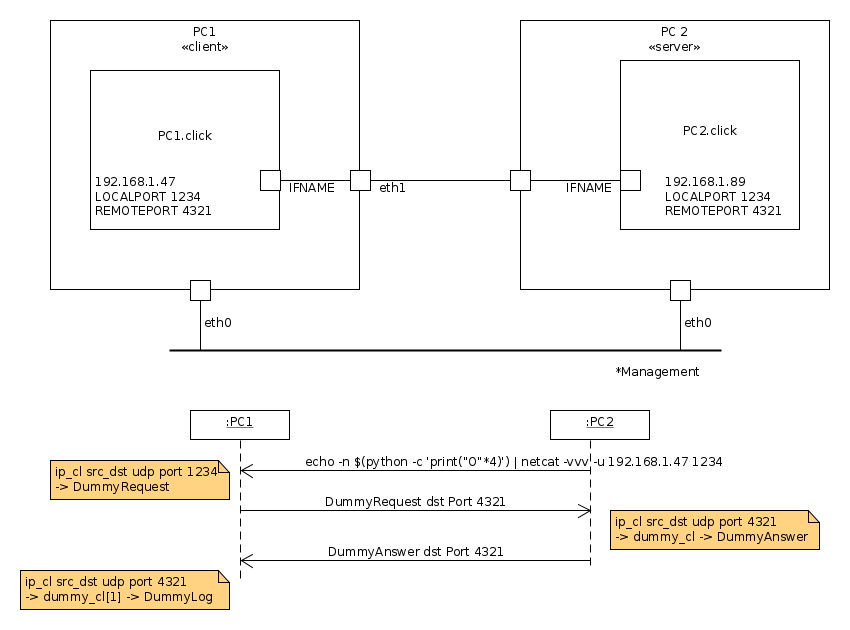

# Protocol implementation tutorial

The dummy protocol is an application protocol and it works on top of UDP. It’s composed of a unique packet type :

>+-+-----+-- ~~ --+
 |T| Len |  Data  |
 +-+-----+-- ~~ --+


+ The user will input a string in a “raw UDP packet” from a specific port, generating a dummy request packet
+ Upon reception of a dummy packet the Data will be printed
+ If the Data corresponds to something we know how to respond to we generate a dummy answer
+ We want to log all received answers and print them every X seconds





## blog articles


https://alan-mushi.github.io/2015/09/15/Click-Modular-Router-tutorial-intro.html
https://alan-mushi.github.io/2015/09/15/Click-Modular-Router-tutorial-part1.html
https://alan-mushi.github.io/2015/09/15/Click-Modular-Router-tutorial-part2.html
https://alan-mushi.github.io/2015/09/15/Click-Modular-Router-tutorial-part3.html
https://alan-mushi.github.io/2015/09/15/Click-Modular-Router-tutorial-part4.html
https://alan-mushi.github.io/2015/09/15/Click-Modular-Router-tutorial-part5.html
https://alan-mushi.github.io/2015/09/15/Click-Modular-Router-tutorial-part6.html


## Implementing the Dummy protocol

Specific elements :

 * DummyProto : define the protocol format
 * DummyClassifier : element to “classify” the type of the packet
 * DummyPrint : element to print the Data
 * DummyLog : element to log the past Data
 * DummyAnswer : element to answer (to a response) a packet
 * DummyRequest : element to generate a request packet

**DummyLog**
This element is used to display received answers periodically. The reason for this element to exist is to demonstrate the use of Timers and of element configuration (using the configure(...) method).
Log the received answers and prints them periodically. Print the received answers every TICK seconds.


**DummyPrint**
The role of this element is to print the Data field of any incoming packet. The incoming packets must be stripped of their headers, leaving only the UDP data. To differentiate requests from answers we also want to print the type of packet. Because we are doing this classification we can take the opportunity to set the annotation for the packet.

A packet consists of a data buffer, which stores the actual packet wire data, and a set of annotations, which store extra information calculated about the packet, such as the destination address to be used for routing. http://read.cs.ucla.edu/click/doxygen/class_packet.html

Annotations have multiple types and are additional information on a packet. Those annotations are indexed using byte length and an area is reserved for it in every packet.

We are setting this annotation so the DummyClassifier can dispatch packets to outputs solely based on the annotation value. Because we need our annotation index to be shared between the “getter” (DummyClassifier) and the “setter” (DummyPrint) you need to put it as a constant in a file both elements will include. Therefore, the designated spot is in DummyProto.hh

DummyPrint Print the 'Data' field of the packet preposed with 'Answer: ' or 'Request: ' depending on the 'T' field.
It also Sets an annotation of type uint8_t at DUMMY_CLASSIFY_ANNO_OFFSET to ease the task of DummyClassifier.


**DummyClassifier**
This element assumes that the packet have the annotation set (by DummyPrint). It uses a PUSH port processing with 3 outputs (REQ, ANS, others).
Request packets go to the first output port and Answer to the second, the rest goes to the 3rd output port. The annotation is an unsigned int on 8 bits and is positionned at DUMMY_CLASSIFY_ANNO_OFFSET of the annotations.


**DummyRequest**
Generate a dummy request packet from the incoming packet


**DummyAnswer**
Store ‘(request -> answer)’ associations and reply to the request with a given answer.


NB
A specific syntax is available to ease the configuration of network interfaces:
`AddressInfo(enp2s0 10.0.0.2 01:02:03:04:05:06);`
you can then use ‘enp2s0’ for the IP or MAC address of a parameter.


## helper scripts

skel_gen.sh : script to generates “skel” click elements
add_handler_mapping.sh  : script to add request/handler in click answer element

## Run

Using vagrant config pc1 and pc2 and network link between the 2 machines on eth1 interface (192.168.56.0/24 subnet)

Config:

    PC 1: 192.168.56.47
    PC 2: 192.168.56.89
    ClickControl handler port for both: 3333
    Input request port 1234

Start click:

```bash
// on pc1
$ sudo click  -p 3333  IFACENAME=eth1 pc1.click
// on pc2
$ sudo click  -p 3333  IFACENAME=eth1 pc2.click
```

Add answers:
```bash
$ export HOST=192.168.56.89
$ export PORT=3333
$ export HANDLER_NAME=h_map
$ export SHORT_NAME=DummyAnswer

$ ./add_handler_mapping.sh 'OOOO|AAAA'
$ ./read_handler.sh
```


From pc2 hen send requests:

```bash
$ echo -n $(python -c 'print("O"*4)') | netcat -vvv -u 192.168.56.47 1234
```


Using ClickController to check config handler
```bash
/vagrant/clickCtrl 192.168.56.21 3333

```

Test ARP 

+ from outside : arping -I vboxnet0 192.168.56.47 -c 1
+ from pc2 : arping -I eth1 192.168.56.47 -c 1


